<picture>
    <source media="(prefers-color-scheme: dark)" srcset="assets/header-dark.svg">
    <source media="(prefers-color-scheme: light)" srcset="assets/header-light.svg">
    
  </picture>

I like making things I can actually use and sometimes things that are just fun to build.

<h2>On my workbench</h2>

Open a drawer. Pick a tool. Each tile leads to its docs.

  
<b>01 &nbsp; Web</b> JavaScript / React / Node.js / Django / HTML / CSS

   
  
Interfaces

  

    <a href="https://developer.mozilla.org/en-US/docs/Web/JavaScript" title="JavaScript documentation">
      <picture>
          <source media="(prefers-color-scheme: dark)" srcset="assets/javascript-dark.svg">
          <source media="(prefers-color-scheme: light)" srcset="assets/javascript-light.svg">
          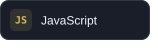
        </picture>
    </a>
    <a href="https://react.dev/" title="React documentation">
      <picture>
          <source media="(prefers-color-scheme: dark)" srcset="assets/react-dark.svg">
          <source media="(prefers-color-scheme: light)" srcset="assets/react-light.svg">
          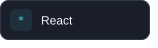
        </picture>
    </a>
    <a href="https://developer.mozilla.org/en-US/docs/Web/HTML" title="HTML documentation">
      <picture>
          <source media="(prefers-color-scheme: dark)" srcset="assets/html-dark.svg">
          <source media="(prefers-color-scheme: light)" srcset="assets/html-light.svg">
          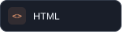
        </picture>
    </a>
    <a href="https://developer.mozilla.org/en-US/docs/Web/CSS" title="CSS documentation">
      <picture>
          <source media="(prefers-color-scheme: dark)" srcset="assets/css-dark.svg">
          <source media="(prefers-color-scheme: light)" srcset="assets/css-light.svg">
          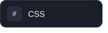
        </picture>
    </a>
  

  
Servers

  

    <a href="https://nodejs.org/en/learn" title="Node.js documentation">
      <picture>
          <source media="(prefers-color-scheme: dark)" srcset="assets/node-dark.svg">
          <source media="(prefers-color-scheme: light)" srcset="assets/node-light.svg">
          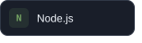
        </picture>
    </a>
    <a href="https://docs.djangoproject.com/" title="Django documentation">
      <picture>
          <source media="(prefers-color-scheme: dark)" srcset="assets/django-dark.svg">
          <source media="(prefers-color-scheme: light)" srcset="assets/django-light.svg">
          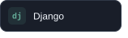
        </picture>
    </a>
  

 

  
<b>02 &nbsp; Apps, games &amp; hardware</b> Python / C++ / C# / Android / React Native / Unreal Engine / Arduino

   
  
Languages

  

    <a href="https://docs.python.org/3/" title="Python documentation">
      <picture>
          <source media="(prefers-color-scheme: dark)" srcset="assets/python-dark.svg">
          <source media="(prefers-color-scheme: light)" srcset="assets/python-light.svg">
          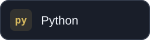
        </picture>
    </a>
    <a href="https://isocpp.org/" title="C++ documentation">
      <picture>
          <source media="(prefers-color-scheme: dark)" srcset="assets/cpp-dark.svg">
          <source media="(prefers-color-scheme: light)" srcset="assets/cpp-light.svg">
          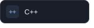
        </picture>
    </a>
    <a href="https://learn.microsoft.com/en-us/dotnet/csharp/" title="C# documentation">
      <picture>
          <source media="(prefers-color-scheme: dark)" srcset="assets/csharp-dark.svg">
          <source media="(prefers-color-scheme: light)" srcset="assets/csharp-light.svg">
          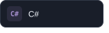
        </picture>
    </a>
  

  
Mobile

  

    <a href="https://developer.android.com/" title="Android documentation">
      <picture>
          <source media="(prefers-color-scheme: dark)" srcset="assets/android-dark.svg">
          <source media="(prefers-color-scheme: light)" srcset="assets/android-light.svg">
          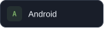
        </picture>
    </a>
    <a href="https://reactnative.dev/" title="React Native documentation">
      <picture>
          <source media="(prefers-color-scheme: dark)" srcset="assets/react-native-dark.svg">
          <source media="(prefers-color-scheme: light)" srcset="assets/react-native-light.svg">
          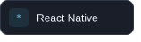
        </picture>
    </a>
  

  
Games &amp; hardware

  

    <a href="https://dev.epicgames.com/documentation/en-us/unreal-engine" title="Unreal Engine documentation">
      <picture>
          <source media="(prefers-color-scheme: dark)" srcset="assets/unreal-dark.svg">
          <source media="(prefers-color-scheme: light)" srcset="assets/unreal-light.svg">
          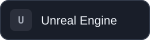
        </picture>
    </a>
    <a href="https://docs.arduino.cc/" title="Arduino documentation">
      <picture>
          <source media="(prefers-color-scheme: dark)" srcset="assets/arduino-dark.svg">
          <source media="(prefers-color-scheme: light)" srcset="assets/arduino-light.svg">
          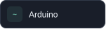
        </picture>
    </a>
  

 

  
<b>03 &nbsp; Day to day</b> Git / Linux

   
  

    <a href="https://git-scm.com/doc" title="Git documentation">
      <picture>
          <source media="(prefers-color-scheme: dark)" srcset="assets/git-dark.svg">
          <source media="(prefers-color-scheme: light)" srcset="assets/git-light.svg">
          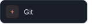
        </picture>
    </a>
    <a href="https://www.linux.org/" title="Linux documentation">
      <picture>
          <source media="(prefers-color-scheme: dark)" srcset="assets/linux-dark.svg">
          <source media="(prefers-color-scheme: light)" srcset="assets/linux-light.svg">
          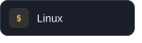
        </picture>
    </a>
  

 

<a href="https://github.com/RedregeX?tab=repositories"><samp>Open my repositories &rarr;</samp></a>

